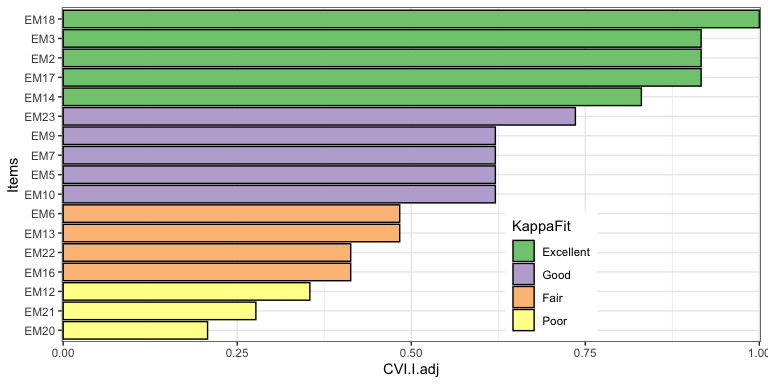

<!-- README.md is generated from README.Rmd. Please edit that file -->

# CVI

<!-- badges: start -->

<!-- badges: end -->

This package pools together various content validity indices (CVI) of
items and scales. The package is designed to be used in the context of
psychological research, but it can be used in other fields as well. The
CVI indices are based on the work of Polit and Beck (2006) and Lynn
(1986). The package provides functions to calculate the following CVI
indices:

- CVI-I (item-level content validity index)
- CVI-I.adj (item-level content validity index adjusted for chance
  agreement)
- CVI-R (item-level content validity ratio)
- S-CVI/Ave (scale-level content validity index based on the average
  method)
- S-CVI/UA (scale-level content validity index based on the universal
  agreement method)

## Installation

You can install the development version of CVI from GitHub:

``` r
if (!require(devtools)) install.packages("devtools")
devtools::install_github("tuomaseerola/CVI")
```

    #> ℹ Loading CVI
    #> [1] '0.1.4.0'

## Example

This shows you how to calculate the content validity of items. There is
a build-in data called FM (Focus-Motivation construct related to
music-relatex emotional experiences) that contains expert ratings (`ID`)
of items (`name`) that they have rated on relevancy scale of 1-4
(`value`). We first load and preview this data.

``` r
library(CVI)
data(FM)
print(knitr::kable(head(FM),digits=2))
```

| ID  | name | value               |
|:----|:-----|:--------------------|
| E01 | EM2  | Extremely Relevant  |
| E01 | EM3  | Extremely Relevant  |
| E01 | EM5  | Moderately Relevant |
| E01 | EM6  | Extremely Relevant  |
| E01 | EM7  | Extremely Relevant  |
| E01 | EM9  | Moderately Relevant |

We can check and summarise the content with `CVI_check` function.

``` r
FM <- CVI_check(FM)
#> [1] "No. Experts: 15"
#> [1] "No. Items: 17"
#> [1] "No. Item response options: 4"
#> [1] "Item response options: Extremely Relevant--Moderately Relevant--Slightly Relevant--Not Relevant"
#> [1] "Missing responses: 53"
#> [1] "Total responses: 255"
```

We then calculate the content validity of the items. The summary gives
*Sum* (how many experts agree and have rated the item as Exteremely or
Moderately Relevant) and *N* (how many expert have rated this item), and
*CVI-I* and *CVI-I.adj* (kappa-adjusted) values for each item and as
well *CVI-R* (ratio). The output also includes two summary descriptions
of what to do with the items based on the CVI-I.adj values (`Decision`
and `KappaFit`).

``` r
Items <- CVI_item(FM)
print(knitr::kable(head(Items),digits=2))
```

| Item | Sum |   N | CVI.I | CVI.R | CVI.I.adj | CVIFit      | KappaFit  | CVRFit         |
|:-----|----:|----:|------:|------:|----------:|:------------|:----------|:---------------|
| EM2  |  11 |  12 |  0.92 |  0.83 |      0.92 | Appropriate | Excellent | Accept \> 0.67 |
| EM3  |  11 |  12 |  0.92 |  0.83 |      0.92 | Appropriate | Excellent | Accept \> 0.67 |
| EM5  |   8 |  12 |  0.67 |  0.33 |      0.62 | Eliminated  | Good      | Reject         |
| EM6  |   7 |  12 |  0.58 |  0.17 |      0.48 | Eliminated  | Fair      | Reject         |
| EM7  |   8 |  12 |  0.67 |  0.33 |      0.62 | Eliminated  | Good      | Reject         |
| EM9  |   8 |  12 |  0.67 |  0.33 |      0.62 | Eliminated  | Good      | Reject         |

We can also visualise the content validity of items using the function
`CVI_visualise`. The default options show CVI-I.adjusted values for each
item and the suggestion based on Kappa value for each item. You can
specify other indices as well.

``` r
CVI_visualise(Items) # default CVI.I.adj and Kappa
```



The content validity for the scale can be obtained from the calculated
items by `CVI_scale` function. The default returns the S-CVI/Ave
(scale-level content validity index based on the average method) but you
can specify other indices as well.

``` r
print(CVI_scale(Items))
#> [1] 0.6720143
```

This *S-CVI/Ave* value of suggest poor overall scale relevance as the
recommended value should be over 0.80 (Polit & Beck, 2006). If we take
all items that actually have a good CVI-I fit (CVIFit is `Appropriate`),
we can recalculate the revised *S-CVI/Ave* value of the scale that has 5
items.

``` r
ItemsRelevant <- Items[Items$CVIFit=='Appropriate',]
print(CVI_scale(ItemsRelevant))
#> [1] 0.9166667
```

An excellent *S-CVI/Ave* value for the scale is achieved in this case.

## References

- Lynn, M. R. (1986). Determination and quantification of content
  validity. *Nursing Research, 35(6)*, 382–385.
- Polit, D. F. & Beck, C. T. (2006). The content validity index: are you
  sure you know what’s being reported? Critique and recommendations.
  *Research in Nursing & Health, 29(5)*, 489–497.
- Romero Jeldres, M., Díaz Costa, E., & Faouzi Nadim, T. (2023). A
  review of Lawshe’s method for calculating content validity in the
  social sciences. *Frontiers in Education, 8*.
  <https://www.frontiersin.org/journals/education/articles/10.3389/feduc.2023.1271335>
